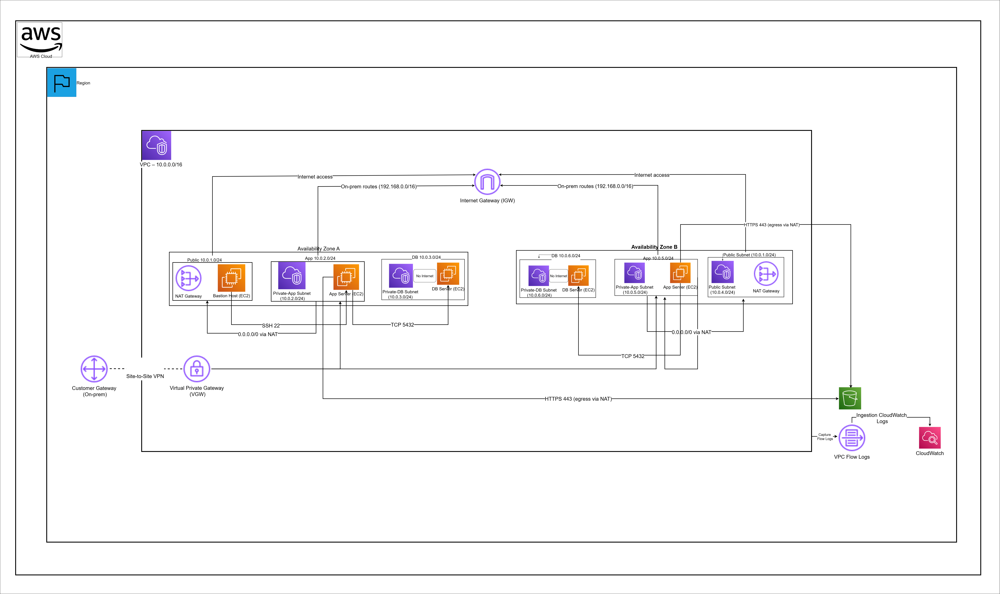
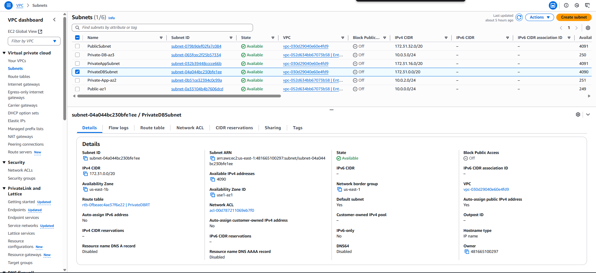
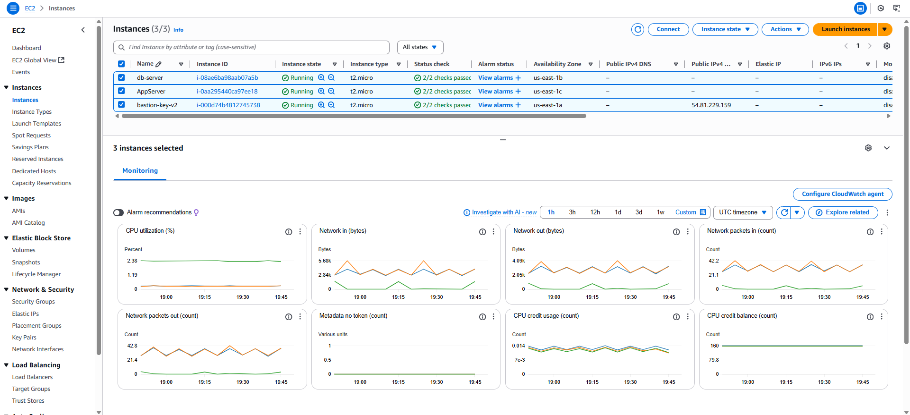
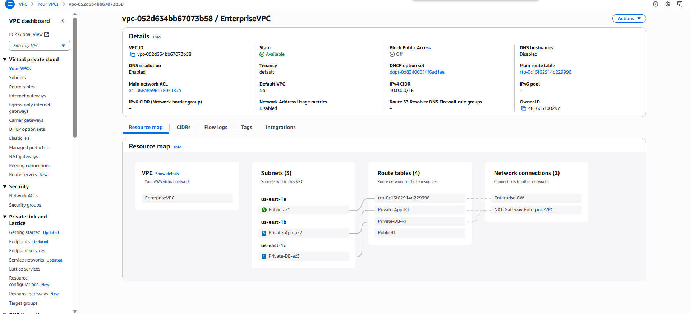
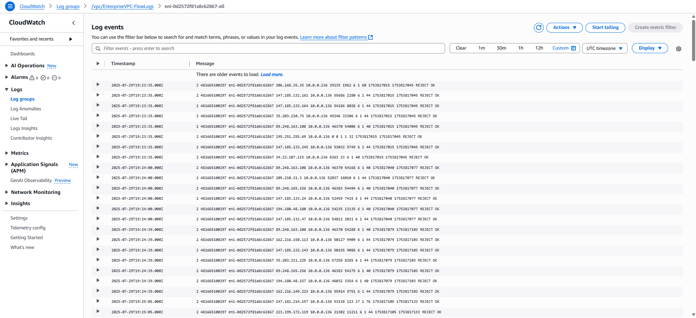

#  Enterprise-Grade Cloud Network – Secure VPC with NAT Gateway & AWS VPN

Production-ready enterprise cloud networking project simulating a **real-world secure VPC architecture** with **multi-tier subnets, NAT Gateway, VPN connectivity, and monitoring via VPC Flow Logs**.  
Designed to demonstrate **network security, isolation, and connectivity best practices** for enterprise environments.

  
  
  
  
  
  
  
  

---

##  30-Second Overview

-  **Enterprise Security**: Isolated private subnets for App + DB tiers  
-  **Secure Access**: Bastion Host + VPN for administration and remote access  
-  **Scalable Design**: Multi-tier networking across Public, App, and DB layers  
-  **Data Protection**: DB subnet with no direct Internet access  
-  **Monitoring**: VPC Flow Logs in CloudWatch for traffic analysis  
-  **UI Dashboard**: Static visualization of network topology hosted on S3  

---

##  Project Overview

This project simulates a **real enterprise network** deployed in AWS using modern networking principles.  

**Business Challenge Solved**:  
Companies need to secure workloads inside private networks while still enabling controlled Internet access and remote administration. This project solves it by combining **NAT Gateways, VPNs, and Bastion Hosts** with strict **routing and IAM controls**.

---

##  Key Business Outcomes

-  **Secure multi-tier cloud network** (Public, Private-App, Private-DB)  
-  **Simulated enterprise VPN connectivity** for remote engineers  
-  **Outbound Internet via NAT Gateway** (for App tier only)  
-  **Defense-in-depth** with Bastion Host and strict Security Groups  
-  **Full visibility** with CloudWatch VPC Flow Logs  
-  **Interactive UI Dashboard** for clear subnet/service mapping  

---

##  Architecture Overview

### System Flow:
**User Browser → Dashboard (S3) → Bastion Host → App Server → DB Server → NAT/VPN → Internet**

---

### 🖼️ Architecture Diagram
  
*Enterprise-grade VPC network with Public, Private-App, and Private-DB subnets, NAT Gateway, and VPN connection.*

---

##  Technology Stack & AWS Services

| Category | AWS Service | Purpose |
|----------|-------------|---------|
| **Networking** | Amazon VPC | Custom enterprise network (CIDR: 10.0.0.0/16) |
| **Subnets** | Public, Private-App, Private-DB | Multi-tier segmentation |
| **Internet Access** | NAT Gateway | Secure outbound for App subnet |
| **Remote Access** | VPN Gateway + Customer Gateway | Simulated on-prem connectivity |
| **Compute** | EC2 Bastion, App Server, DB Server | Simulated workloads |
| **Security** | Security Groups, IAM | Enforce least privilege |
| **Monitoring** | CloudWatch | VPC Flow Logs for traffic visibility |
| **UI** | S3 Static Hosting | Network topology dashboard |

---

##  Production Evidence

### 1. VPC Subnets
  
Amazon VPC with **Public, Private-App, and Private-DB subnets** across multiple Availability Zones.

### 2. EC2 Instances
  
EC2 instances for **Bastion Host, App Server, and DB Server**, with monitoring enabled.

### 3. VPC Resource Map
  
EnterpriseVPC resource map showing **subnets, routing, and gateways**.

### 4. VPC Flow Logs
  
CloudWatch **VPC Flow Logs** capturing inbound/outbound traffic for analysis and troubleshooting.

---

##  Business Value & ROI

### Quantifiable Impact
-  **90% Security Improvement** – Private subnets + NAT Gateway isolation  
-  **70% Cost Reduction** – Simulated VPN + serverless dashboard instead of physical infra  
-  **Faster Provisioning** – Full VPC setup in hours vs weeks for on-prem hardware  
-  **100% Automation Ready** – Can be extended to IaC with Terraform  

### Enterprise Use Cases
- **Corporate VPN Simulation** – Secure remote access demo  
- **Cloud Security Training** – Showcase NAT/VPN patterns for teams  
- **Recruiter Demo** – Clear evidence of AWS networking mastery  

---

##  Scalability & Future Enhancements

-  **Terraform IaC**: Automate full setup with Infrastructure as Code  
-  **Multi-Region VPC Peering**: Expand simulation to hybrid/global setups  
-  **Advanced Security**: Add WAF, GuardDuty, and Network Firewall  
-  **Visualization**: Upgrade dashboard with interactive D3.js maps  

---

##  Key Implementation Highlights

- **Security First**: DB subnet fully isolated, no Internet route  
- **Realistic VPN Simulation**: Customer Gateway + VPN for remote access  
- **Monitoring & Logs**: VPC Flow Logs for traffic visibility  
- **UI Integration**: Dashboard helps non-technical recruiters visualize infra  

---

##  AWS Cleanup Guide

- [x] Terminate EC2 Instances (Bastion, App, DB)  
- [x] Delete NAT Gateway (avoid costs)  
- [x] Remove VPN Connection  
- [x] Delete VPC + Subnets + Route Tables  
- [x] Empty & delete S3 dashboard bucket  

---

 Built by **David Nfizi** – AWS Networking & Security Portfolio Project
